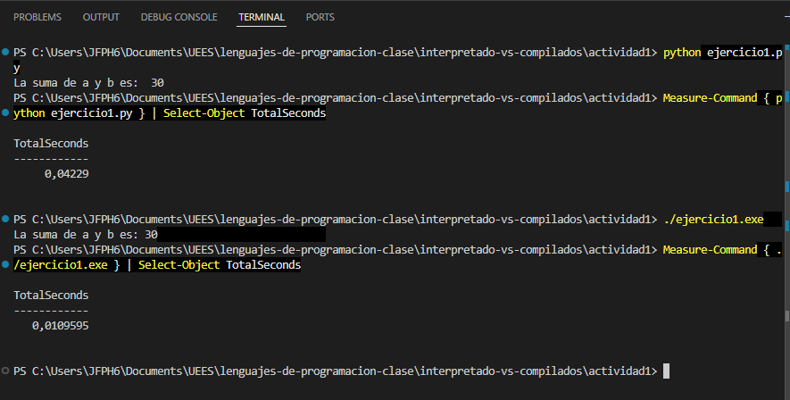

# Comparativa de ejecución: C vs Python

Para medir el rendimiento de cada lenguaje, investigamos el comando `Measure-Command` en PowerShell. Esto nos permitió comparar el tiempo que tarda el sistema en ejecutar el script de Python frente al archivo compilado de C.

## Resultados

| Lenguaje | Tiempo (Segundos) |
| :--- | :--- |
| **Python** | 0.0422 |
| **C** | 0.0109 |

## Conclusión
C es más rápido porque ya está compilado a lenguaje máquina. Python tarda más porque es interpretado, lo que significa que el sistema debe procesar el código al mismo tiempo que lo ejecuta.
