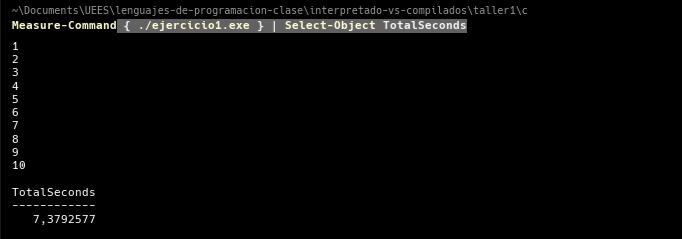
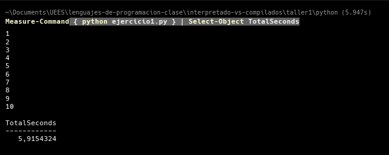
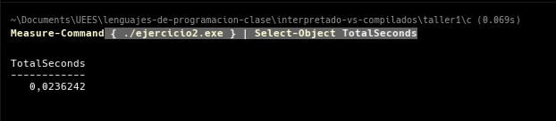
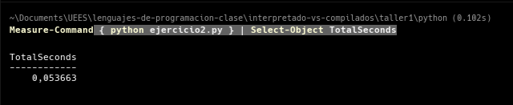
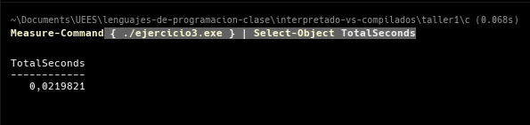
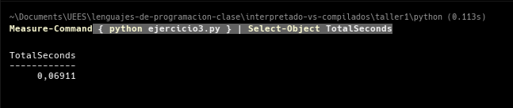

# Reporte de Rendimiento: Lenguajes Compilados (C) vs. Interpretados (Python)

Comparamos la eficiencia de ejecución entre C y Python utilizando el comando `Measure-Command` de PowerShell.

## 1. Resumen comparativo de tiempos

| Ejercicio | Tiempo C (Segundos) | Tiempo Python (Segundos) | Ganador |
| :--- | :--- | :--- | :--- |
| **Primero**: Entrada de datos | 7.3792577 | 5.9154324 | **N/A** (Depende del input/usuario) |
| **Segundo**: 500 Aleatorios | 0.0236242 | 0.0536630 | **C** (2.2x más rápido) |
| **Tercero**: Arreglos Paralelos | 0.0219821 | 0.0691100 | **C** (3.1x más rápido) |

---

## 2. Evidencias de ejecución

### Ejercicio Primero: Ingreso de 10 valores por teclado

* **Prueba en C:** 
* **Prueba en Python:** 

### Ejercicio Segundo: Generación de 500 números aleatorios

* **Prueba en C:** 
* **Prueba en Python:** 

### Ejercicio Tercero: Gestión de sucursales (Arreglos paralelos)

* **Prueba en C:** 
* **Prueba en Python:** 

---
